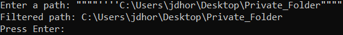
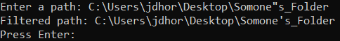
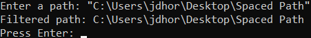
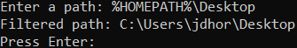
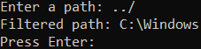

# path_tools
**The "path_tools" library**, is a multi-OS Python library, that includes advanced path-related functions.

## **The "filter_path()" Function:**
### **Syntax:** 
#### filter_path(PATH)
### **Description:**
**1.)** Uses path_tools' built-in "appropriate_quotes()" function, to remove any prepended quotes and matching quotes, at the end of the supplied path (If present), as well as, replace any OS-inappropriate quotes, in the path, with the OS-appropriate quotes (Also, if present)
**2.)** The "appropriate_quotes()" function, checks if the supplied path contains a space, if it does, the OS-appropriate quotes are added to the beginning and end of the path, and the OS-appropriately quoted path, is returned to the "filter_path()" function, if the path does not contain a space, the "appropriate_quotes()" function returns a path to the "filter_path()" function, with any quotes removed, that are not part of the path and replaced, when they are part of the path, but are OS-inappropriate quotes\
**3.)** Uses path_tools' built-in "unquote_path()" function, to remove the beginning and end quotes, added by the "appropriate_quotes()" function,
if the path contains a space, then returns the unquoted path, to the "filter_path()" function\
**4.)** Converts any OS-specific variables, in the path, using the "os" module\
**4.)** Converts any dot-sequences, in the path, using the "pathlib" module\
**5.)** Returns a filtered and converted path (See the test file: "filter_path.py", in the Tests folder)

### **Examples:**
\
\
\
\

## **The "recursive_files_and_bytes_total()" Function:**
### **Syntax:** 
#### recursive_files_and_bytes_total(PATH)
### **Description:**
**1.)** Filters the supplied PATH variable, using path_tools' built-in "filter_path()" function
**2.)** Recursively scans, for the total number of files and bytes of data, using the "os" module
**3.)** Returns the total number of files and the total number of bytes, of data ()

## **The "recursive_copy_with_progress()" Function:**
### **Syntax:** 
#### recursive_copy_with_progress(SOURCE_PATH, DESTINATION_PATH)
### **Description:**
**1.)** Removes or replaces OS-inappropriate or unneccessary quotes, OS-specific variables, and dot-sequences, in the SOURCE_PATH or DESTINATION_PATH variables supplied, OS-appropriately, with path_tools' built-in "filter_path()", "appropriate_quotes()", and "unquote_path()" functions, as well as, the help of the "os", "platform", and "pathlib" modules\
**2.)** Calculates and displays the total number of files and bytes to be copied, from the source path, using path_tools' built-in "recursive_files_and_bytes_total()", "convert_bytes()" functions, and the help of, the "os" module\
**3.)** Creates a new directory, in the destination path, matching the source path's folder name, using the "os" module, if the folder does not already exists in the destination path, if it does exist, in the destination path, a new directory, with a new name, is created, in the destination path\
**4.)** Recursively copies all files and folders within the chosen source path, to the destination path, with the source path folder's or new folder's name appended, to the destination path, while displaying a live progress bar and an ETA, until finished, with path_tools' built-in "recursive_copy_progress_bar()", "convert_seconds()" functions, and the help of the, "sys", "shutil", and "time" modules\
**5.)** All of the above, can be done with a single "recursive_copy_with_progress(SOURCE_PATH, DESTINATION_PATH)" function call, after importing the "path_tools" library (See the test file: "recursive_copy_with_progress.py", in the Tests folder)

### **Example:**

