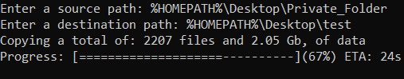

# path_tools
**"path_tools.py"**, is a multi-OS Python library, that includes advanced path filtering functions, as well as, a "recursive_copy_with_progress()" function, that displays a progress bar and an ETA, while recursively copying files.

**"recursive_copy_with_progress()":**

