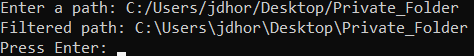
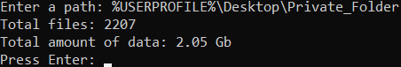

# path_tools
The "path_tools" library, is a multi-OS compatible python library, that includes advanced path-related functions.

## **The "is_safely_quoted()" Function:**
### **Syntax:** is_safely_quoted(PATH)
### **Description:**
**1.)** Checks if the supplied path, is OS-appropriately quoted and has no extra quotes\
**2.)** Returns True, if the supplied path is appropriately quoted (Or appropriately not), otherwise False

## **The "filter_path()" Function:**
### **Syntax:** filter_path(PATH)
### **Description:**
**1.)** Uses "path_tools"' built-in "appropriate_quotes()" function, to remove any prepended quotes and matching quotes, at the end of the supplied path (If present), as well as, replace any OS-inappropriate quotes, in the path, with the OS-appropriate quotes (Also, if present)\
**2.)** The "appropriate_quotes()" function, checks if the supplied path contains a space, if it does, the OS-appropriate quotes, are added to the beginning and end of the path and the OS-appropriately quoted path, is returned to the "filter_path()" function, if the path does not contain a space, the "appropriate_quotes()" function, returns a path to the "filter_path()" function, with any quotes removed, that are not part of the path and replaced, when they are part of the path, but are OS-inappropriate quotes\
**3.)** Uses "path_tools"' built-in "unquote_path()" function, to remove the beginning and end quotes, added by the "appropriate_quotes()" function,
if the path contains a space, then returns the unquoted path, to the "filter_path()" function\
**4.)** Converts any OS-specific variables, in the path, using the "os" module\
**5.)** Converts any dot-sequences, in the path, and replaces OS-inappropriate slashes, using the "pathlib" module\
**6.)** Returns a filtered and converted path (See the test file: "filter_path.py", in the "Tests" folder)

### **Examples:**
\
\
\
\

\

## **The "recursive_files_and_bytes_total()" Function:**
### **Syntax:** recursive_files_and_bytes_total(PATH)
### **Description:**
**1.)** Uses "path_tools"' built-in "filter_path()" function, to filter the supplied path\
**2.)** Recursively scans, for the total number of files and bytes, of data, using the "os" module\
**3.)** Returns the total number of files and the total number of bytes, of data (See the test file: "recursive_files_and_bytes_total.py", in the "Tests" folder)\
**4.)** The "path_tools" library, includes a "convert_bytes()" function, to appropriately convert bytes, to kilobytes, megabytes, gigabytes, and terrabytes, which can be used on the total bytes return value, of the "recursive_files_and_bytes_total()" function

### **Example:**
\

## **The "recursive_copy_with_progress()" Function:**
### **Syntax:** recursive_copy_with_progress(SOURCE_PATH, DESTINATION_PATH)
### **Description:**
**1.)** Uses "path_tools"' built-in "filter_path()" function, to filter the supplied source and destination paths\
**2.)** Calculates and displays the total number of files and bytes to be copied, from the source path, using path_tools' built-in "recursive_files_and_bytes_total()", "convert_bytes()" functions, and the help of the "os" module\
**3.)** Creates a new directory, in the destination path, matching the source path's folder name, using the "os" module, if the folder does not already exist in the destination path, if it does exist, in the destination path, a new directory, with a new name, is created in the destination path\
**4.)** Recursively copies all files and folders within the supplied source path, to the supplied destination path, while displaying a live progress bar and an ETA, until finished, using "path_tools"' built-in "recursive_copy_progress_bar()", "convert_seconds()" functions, and the help of the, "sys", "shutil", and "time" modules (See the test file: "recursive_copy_with_progress.py", in the "Tests" folder)

### **Example:**

